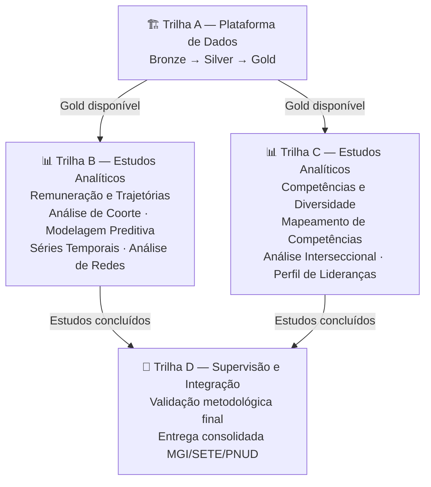
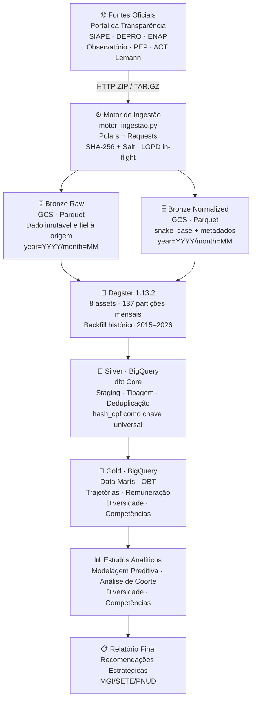

# Data Lake Analytics GOV
### Plataforma de Análise de Pessoal da Administração Pública Federal

**Motivação:** PNUD BRA/21/011 — MGI/SETE/SGP  
**Responsável Técnico:** Ediney Magalhães Junior — Analytics Engineer | Data Engineer

---

## Visão Geral

Este projeto implementa uma **Plataforma de Dados Governamental** para consolidação, tratamento e análise da força de trabalho do Poder Executivo Federal, abrangendo quatro editais do PNUD em parceria com o MGI/SETE/SGP.

O pipeline ingere dados de múltiplas fontes oficiais (SIAPE, DEPRO, ENAP, Observatório de Pessoal, PEP, ACT Lemann), aplica pseudonimização LGPD in-flight e persiste os dados em formato Parquet particionado no Google Cloud Storage, seguindo a arquitetura Medallion (Bronze → Silver → Gold).

A plataforma de dados não é o produto final — é a fundação que viabiliza os estudos analíticos e estatísticos exigidos pelos editais. Os dados tratados e modelados subsidiam diagnósticos, modelagem preditiva e recomendações estratégicas para a gestão de pessoas no Serviço Público Federal.

> Para contexto institucional, decisões arquiteturais e roadmap completo, consulte a pasta [`docs/`](docs/).

---

## Estudos e Produtos

O projeto é estruturado em quatro trilhas com dependência em cascata:



**Trilhas B e C** são paralelas e independentes entre si, mas complementares no resultado final. Ambas dependem da Camada Gold (Trilha A).  
**Trilha D** é ativada somente após a conclusão de B e C.

> Estado atual de cada trilha: [`docs/ROADMAP_ARQUITETURAL.md`](docs/ROADMAP_ARQUITETURAL.md)

---

## Arquitetura da Plataforma de Dados



---

## Fontes de Dados

| Sistema | Descrição | Assets | Status |
|:--------|:----------|:------:|:------:|
| SIAPE | Servidores ativos, remuneração, aposentados, afastamentos | 4 | ✅ Bronze e Silver concluídos |
| DEPRO | Alocação, cargos, aposentadorias por órgão | 3 | ✅ Bronze e Silver concluídos |
| ENAP | Matrículas e capacitação — Escola Virtual Gov | 1 | ✅ Bronze e Silver concluídos (sem linkage com SIAPE/DEPRO — ver ADR-009) |
| Observatório de Pessoal | Produtos analíticos do MGI | — | ⏳ Previsto |
| PEP | Desempenho e avaliação | — | ⏳ Previsto (Sprint 3.5) |
| ACT Lemann | Competências | — | ⏳ Disponibilidade não confirmada |

> Detalhamento de schemas, URLs e regras de ingestão: [`docs/DICIONARIO_DE_DADOS_FONTES.md`](docs/DICIONARIO_DE_DADOS_FONTES.md)

---

## Stack Tecnológica

| Camada | Tecnologia | Função |
|:-------|:-----------|:-------|
| Ingestão | Python 3.13, Polars, Requests | Motor de extração e processamento in-memory |
| Segurança | hashlib (SHA-256 + Salt) | Pseudonimização LGPD in-flight |
| Orquestração | Dagster | Agendamento, backfill e monitoramento |
| Storage | Google Cloud Storage + gcsfs | Camada Bronze em Parquet particionado |
| Transformação | dbt Core 1.12.0 | Silver (concluído — 8 modelos de staging) e Gold (planejado) |
| Data Warehouse | BigQuery | Silver em produção (dataset `prata`); Gold planejado |
| Configuração | python-dotenv | Variáveis de ambiente como contrato |

---

## Como Executar

### 1. Pré-requisitos

- Python 3.12+
- Miniconda ou venv
- Conta GCP com Service Account (`etl-robot`) com Storage Object Admin

### 2. Configuração do Ambiente

```powershell
# Ativar ambiente virtual
.venv\Scripts\activate

# Instalar dependências
pip install -r requirements.txt
```

### 3. Variáveis de Ambiente

Crie um arquivo `.env` na raiz (não versionado):

```env
HASH_SALT=sua_chave_de_anonimizacao
DESTINO_BRONZE=gs://gov-datalake-analytics-bronze
GOOGLE_APPLICATION_CREDENTIALS=caminho/para/service_account.json
```

### 4. Subir o Dagster

```powershell
dagster dev
```

Acesse `http://localhost:3000` para visualizar os assets, disparar materializações e monitorar o backfill.

---

## Estrutura do Repositório

```
/
├── dagster_pipelines/          # Orquestração — assets Bronze por sistema
│   ├── assets/bronze/          # siape.py, depro.py, enap.py
│   ├── resources/              # motor_ingestao.py (Polars + Requests)
│   └── __init__.py             # Definitions — registro dos 8 assets
├── gov_datalake_analytics/      # dbt Core — modelos Silver (concluído) e Gold (planejado)
│   └── models/staging/          # stg_siape__*, stg_depro__*, stg_enap__* (8 modelos)
├── docs/                       # Documentação técnica
│   ├── adrs/                   # Registros de Decisões Arquiteturais
│   ├── ROADMAP_ARQUITETURAL.md
│   ├── DICIONARIO_DE_DADOS_FONTES.md
│   ├── PROPOSTA_ARQUITETURA_MAPEAMENTO.md
│   ├── RELATORIO_DIAGNOSTICO.md
│   └── TERMO_HOMOLOGACAO_BRONZE.md
├── .env.example                # Modelo de variáveis de ambiente
├── .gitignore
├── requirements.txt
└── README.md
```

---

## Documentação

| Documento | Descrição |
|:----------|:----------|
| [`ROADMAP_ARQUITETURAL.md`](docs/ROADMAP_ARQUITETURAL.md) | Estado atual do projeto — 4 trilhas, fases e sprints |
| [`PROPOSTA_ARQUITETURA_MAPEAMENTO.md`](docs/PROPOSTA_ARQUITETURA_MAPEAMENTO.md) | Visão arquitetural, princípios e decisões técnicas |
| [`DICIONARIO_DE_DADOS_FONTES.md`](docs/DICIONARIO_DE_DADOS_FONTES.md) | Schemas, URLs e regras de ingestão por fonte |
| [`TERMO_HOMOLOGACAO_BRONZE.md`](docs/TERMO_HOMOLOGACAO_BRONZE.md) | Evidências de validação da Camada Bronze |
| [`docs/adrs/`](docs/adrs/) | Registro histórico de decisões arquiteturais (ADR-001 a 015) |

---

## Princípios Arquiteturais

- **Segurança First** — pseudonimização LGPD aplicada in-flight, antes de qualquer persistência
- **Analytics as Code** — todo o fluxo versionado em Git com Conventional Commits
- **Idempotência** — reprocessamento sem duplicidade via particionamento Overwrite
- **FinOps** — Hive Partitioning no GCS e Clustering no BigQuery para controle de custos

> Decisões técnicas detalhadas nos ADRs em [`docs/adrs/`](docs/adrs/)