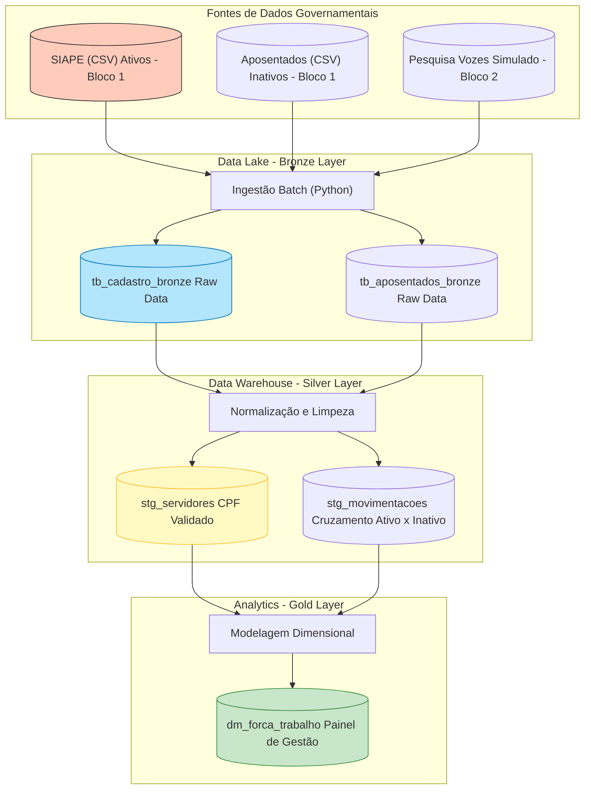
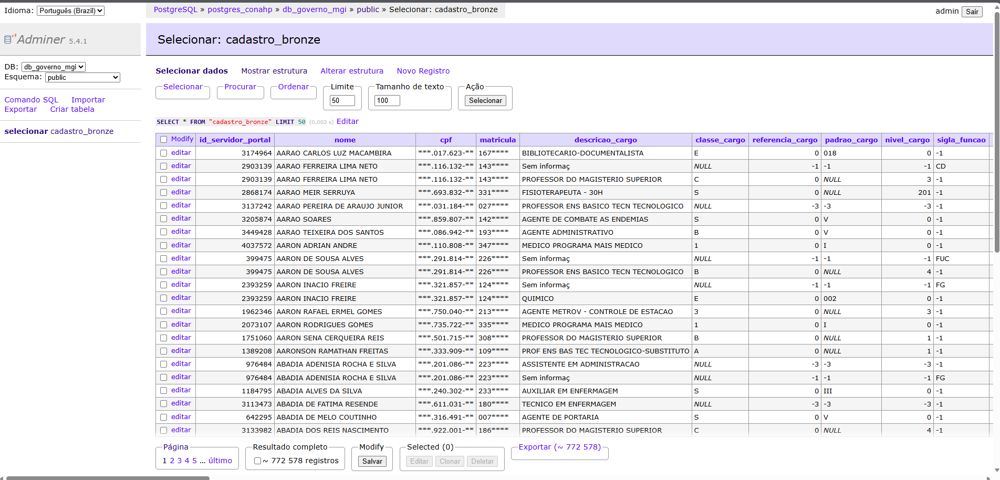

# RELATÓRIO TÉCNICO: PRODUTO 1
## Diagnóstico da Situação Atual e Ingestão Inicial (Data Lake)

**Projeto:** Implementação de Data Lake Governamental (SIAPE)
**Data:** 02/02/2026
**Responsável:** Ediney Magalhães - Engenheiro de Dados
**Versão:** 1.0

---

## 1. Sumário Executivo
Este documento formaliza a análise do **Produto 1**, compreendendo a ingestão da base bruta de servidores federais (Novembro/2025) e o diagnóstico de qualidade dos dados. Foram ingeridos com sucesso **772.471 registros**, identificando-se inconsistências críticas de completude (CPFs nulos) e padronização (cargos mistos) que serão tratadas na próxima fase (Camada Prata).

---

## 2. Metodologia e Arquitetura
Para garantir a auditabilidade, segurança e reprodutibilidade do processo, foi adotada a abordagem **ELT (Extract, Load, Transform)**.

### 2.1 Stack Tecnológico e Orquestração
A infraestrutura foi desenhada para suportar escalabilidade horizontal:
- **Orquestração (Target):** Scripts Python (Ambiente de Lab).
- **Armazenamento:** PostgreSQL 15 (Camada Bronze).
- **Ingestão:** Python 3.13 (Pandas/SQLAlchemy).

### 2.2 Diagrama de Arquitetura de Dados
Abaixo, o fluxo proposto contemplando a interoperabilidade entre as bases do Bloco 1 (SIAPE/Aposentados) e Bloco 2 (Dados Não Estruturados).

### 2.2 Estratégia de Ingestão (Camada Bronze)
Os dados foram carregados na tabela `cadastro_bronze` utilizando tipagem dinâmica (`VARCHAR`) e permissividade de nulos (`NULL`). Essa estratégia previne a perda de dados durante a carga, transferindo a responsabilidade da limpeza para o banco de dados.

**Evidência de Carga:**

> Figura 1: Amostra de dados carregados no Adminer, demonstrando volumetria e tipagem mista.

---

## 3. Dicionário de Dados Preliminar (Camada Bronze)
Abaixo, a estrutura mapeada do arquivo de origem conforme ingerido no banco de dados:

| Coluna | Tipo (Banco) | Descrição Preliminar |
| :--- | :--- | :--- |
| `id_servidor_portal` | `bigint` | Identificador único do sistema de origem. |
| `nome` | `varchar(255)` | Nome completo do servidor. |
| `cpf` | `varchar(50)` | Cadastro de Pessoa Física (chave de identificação). |
| `matricula` | `varchar(255)` | Matrícula funcional no órgão. |
| `descricao_cargo` | `varchar(255)` | Nome do cargo (ex: Bibliotecário, Professor). |
| `padrao_cargo` | `varchar(255)` | Nível salarial/carreira (Campo crítico). |
| `uorg_lotacao` | `varchar(255)` | Unidade organizacional de lotação. |

---

## 4. Diagnóstico de Qualidade de Dados
A auditoria técnica revelou os seguintes pontos de atenção que impactam as regras de negócio:

### 4.1. Volumetria e Integridade
- **Total de Registros:** 772.471 servidores.
- **Perda na Ingestão:** ~100 linhas (0.01%), dentro da margem de erro aceitável para arquivos flat (CSV).

### 4.2. Completude (Identificadores)
Identificamos falhas graves na identificação única dos indivíduos:
- **Problema:** 34.748 registros sem CPF preenchido (**4.5% da base**).
- **Impacto:** Inviabiliza o cruzamento direto com bases da Receita Federal e Folha de Pagamento.

### 4.3. Consistência de Domínio (Coluna: `padrao_cargo`)
A coluna apresenta alta entropia, misturando diferentes padrões de preenchimento para a mesma informação lógica:
- **Nulos/Vazios:** ~40% da base (313.000 registros).
- **Placeholders de Sistema:** Uso de `-1` e `-3`.
- **Polimorfismo:** Coexistência de:
    - Algarismos Romanos: `V`, `IV`, `III`
    - Numéricos com zero: `018`, `002`
    - Textos diversos: `CAT` (Catedrático), `CD`

---

## 5. Plano de Ação (Próximos Passos)
Com base neste diagnóstico, as ações para o **Produto 2 (Modelagem e Limpeza)** serão:

1.  **Criação da Camada Prata:** Desenvolvimento de tabelas particionadas e tipadas.
2.  **Saneamento de `padrao_cargo`:** Implementação de script SQL (`CASE WHEN`) para converter numerais romanos e normalizar o campo.
3.  **Segregação de Inconsistentes:** Criação de uma tabela de quarentena para os 34 mil registros sem CPF.

---
